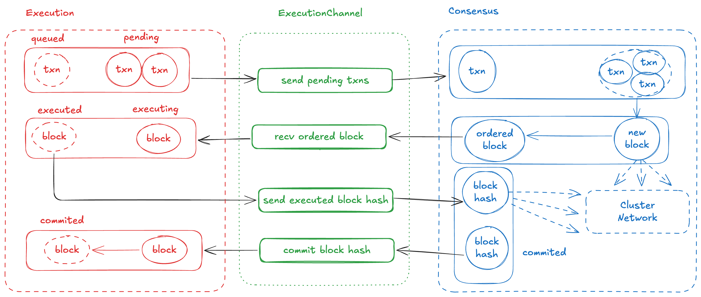
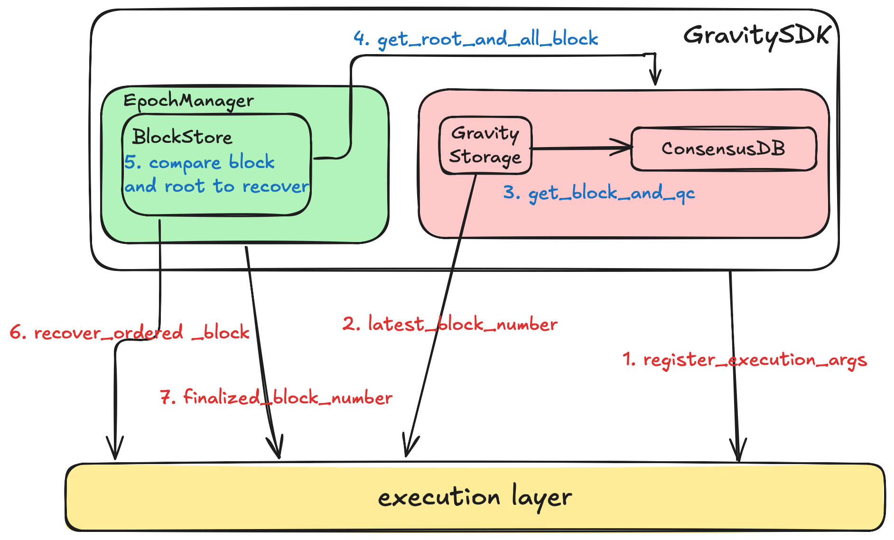
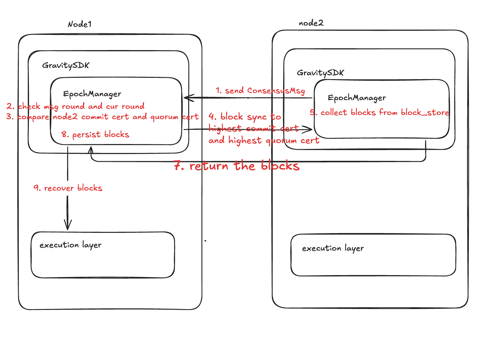

# GCEI (Gravity Consensus Execution Interface) Protocol Specification

## 1. Overview

The Gravity Consensus Execution Interface (GCEI) protocol standardizes how a blockchain’s consensus and execution layers
interact. By leveraging Aptos-BFT as its consensus foundation, GCEI ensures orderly coordination between transaction
ordering and state execution, while also offering robust recovery features in the event of node failures. In this
protocol, the ExecutionChannel handles the transaction lifecycle and state updates, whereas the Recovery mechanism
enables nodes to swiftly synchronize block heights and rejoin the network following unexpected shutdowns.

GCEI facilitates communication between these layers as follows:

- **ExecutionChannel Layer**: Responsible for processing transactions and updating the blockchain state.
- **Recovery Layer**: Handles recovery operations to maintain consistency in the event of failures.

```text
Consensus Layer ←→ ExecutionChannel API ←→ Execution Layer
        ↑                                         ↑
        └──────── Recovery API ───────────────────┘
```

## 2.ExecutionChannel API

From the perspective of a transaction’s lifecycle, the `ExecutionChannel APIs` defines the following methods:

1. **`send_pending_txns`**

    - **Input**: None
    - **Output**: Returns `Result<(Vec<VerifiedTxnWithAccountSeqNum>)>`, which contains a verified
      transaction (`VerifiedTxn`) along with the committed nonce of the transaction sender’s account.
    - **Usage**: When called, this method retrieves all pending transactions from the transaction pool and then clears
      the pending queue.

2. **`recv_ordered_block`**

    - **Input**: A `BlockID` and an `OrderedBlock` (of type `ExternalBlock`), which contains ordered transactions and
      block metadata.
    - **Output**: Returns `Result<()>`, indicating whether the block is successfully received and accepted by the
      execution layer.
    - **Usage**: After the consensus engine proposes a block, it sends the block to the execution layer for transaction
      execution. This method allows the execution layer to receive and process the ordered block.

3. **`send_executed_block_hash`**

    - **Input**: A target block number (`BlockNumber`) and its corresponding block identifier (`BlockID`).
    - **Output**: Returns `Result<(ComputeRes)>`, which includes the computed `BlockHash` and the total number of
      transactions (`TxnNum`) processed so far.
    - **Usage**:
        - Once the execution layer computes the state commitment (i.e., the `BlockHash`), it sends this information to
          the consensus layer for finalization. The consensus layer attempts to reach a 2f+1 light consensus with other
          validators.
        - If the finalized state commitment deviates significantly from the originally proposed blocks, the pipeline
          controller may adjust the block proposing pace accordingly.

4. **`commit_block_info`**

    - **Input**: A vector of `BlockID` values, representing the blocks to be committed.
    - **Output**: Returns `Result<()>`, indicating the success or failure of the operation.
    - **Usage**: When the state commitment is finalized, the consensus layer notifies the execution layer to commit the
      block hash to the blockchain storage.

   


For the life cycle of a batch request, you can see [Gravity SDK Architecture](./book/docs/architecture.md).

## 3 Recovery

This chapter explains how Gravity SDK handles node recovery after an unexpected shutdown by synchronizing the block
heights of the Execution Layer and the Consensus Layer, and then catching up with other nodes in the network if
necessary.

### 3.1 Overview

Recovery in Gravity SDK focuses on ensuring that both the Execution Layer and the Consensus Layer regain a consistent
block state, allowing the node to safely rejoin the network. The process consists of:

1. **Self-Recovery (Execution Layer)**
    - The Execution Layer itself guarantees local recovery of its internal state.
2. **Consensus Layer Block Replay**
    - Gravity SDK replays missing blocks from the Consensus Layer into the Execution Layer to align their heights.
3. **Node-to-Node Synchronization**
    - Once local replay is complete, the node compares its round/height with other validators.
    - If it lags behind, it initiates Block Sync (or State Sync in future improvements) to quickly catch up.

### 3.2 Core Concepts of Recovery

GravitySDK divides recovery into local restoration and network-based synchronization:

1. Local Restoration
    - Execution Layer replays and recovers its blocks.
    - Consensus Layer replays and recovers its local batches.
2. Network-Based Synchronization
    - If local data is incomplete, the node retrieves missing blocks from peers through Block Sync (and potentially
      State Sync in future iterations).

There are three principles when recovery:

- **Local Data Priority**: Use existing local data first to reach the highest possible block height without causing
  inconsistent reads later.
- **Trusted Internal Transfers**: Transactions or blocks shared among a node’s own modules (e.g., blocks with 2f+1
  votes) typically don’t require extra verification.
- **Strict External Verification**: Data from other nodes must undergo full checks, such as multi-signature validation
  and state-hash verification.

### 3.3 Recovery Flow

1. **Obtain Execution Layer Block Height**: Use latest_block_number to find out how far the Execution Layer has
   progressed.
2. **Retrieve Blocks and QCs from ConsensusDB**: Load local consensus data (blocks and QCs).
3. **Find the Corresponding Recovery Root**: Match the Execution Layer’s latest block number with the closest block in
   the Consensus Layer, treating that block as the root for replay.
4. **Compare Root with QC**: Identify blocks whose round is greater than the root’s round.
5. **Replay Missing Blocks**: Invoke recover_ordered_block to fill in any missing blocks on the Execution Layer side.

Once the local block replay is completed, the node can communicate with peers. If the node’s round is behind during
these communications, it initiates Block Sync to obtain the latest blocks from other nodes.

### 3.4 Recovery API Definition

The `Recovery APIs` defines the following methods which help gravity node recover from an unexpected shutdown:

```rust
#[async_trait]
pub trait RecoveryApi: Send + Sync {
    async fn latest_block_number(&self) -> u64;

    async fn recover_ordered_block(&self, parent_id: BlockId, block: ExternalBlock) -> Result<(), ExecError>;

    async fn finalized_block_number(&self) -> u64;

    async fn register_execution_args(&self, args: ExecutionArgs);
}
```

1. `latest_block_number()`: Retrieves the latest block height known to the Execution Layer.
2. `recover_ordered_block(parent_id, block)`: Replays the specified block from the Consensus Layer to the Execution
   Layer if the Execution Layer is missing it.
3. `register_execution_args(args)`: Collects initial data from the Consensus Layer at startup and sends it to the
   Execution Layer to facilitate recovery.
4. `finalized_block_number()`: Returns the Execution Layer’s highest fully persisted (finalized) block number.



### 3.5 Network-Based Synchronization Flow

When a node discovers it is behind others (e.g., receiving a higher round in a ConsensusMsg), it should ask other nodes
for the latest block. Here is an example with 2 nodes:

1. Node1 receives ConsensusMsg request from Node2
2. Node1 compares Msg Round with current Round
    - RoundManager::ensure_round_and_sync_up: Compare msg round with current node round, execute sync_up if current
      round is smaller
3. Node1 compares highest commit cert and highest quorum cert from Msg
4. Node1 initiates Block Sync request to Node2 to sync to latest highest quorum cert
    - BlockStore::add_certs
        - sync_to_highest_commit_cert: Sync to highest commit cert
        - sync_to_highest_quorum_cert: Sync to highest quorum cert
        - fast_forward_sync: Send request to other nodes
5. Node2 collects corresponding blocks and LedgerInfo and returns to Node1
    - BlockStore::process_block_retrieval: Collect and return blocks and LedgerInfo needed by node1
6. Node1 persists received data and initiates consensus layer recovery process
   

## 4. Conclusion

In summary, the GCEI protocol unifies the processes of transaction ordering, state execution, and node recovery,
allowing for a seamless flow of data between the consensus and execution layers. By employing the Aptos-BFT algorithm
alongside well-defined APIs for both execution and recovery, GCEI provides a versatile framework that can be adapted to
various blockchain use cases. Its focus on standardized interactions, robust fault tolerance, and efficient
synchronization ensures that Gravity-based networks maintain both consistency and high performance under diverse
operational conditions.
